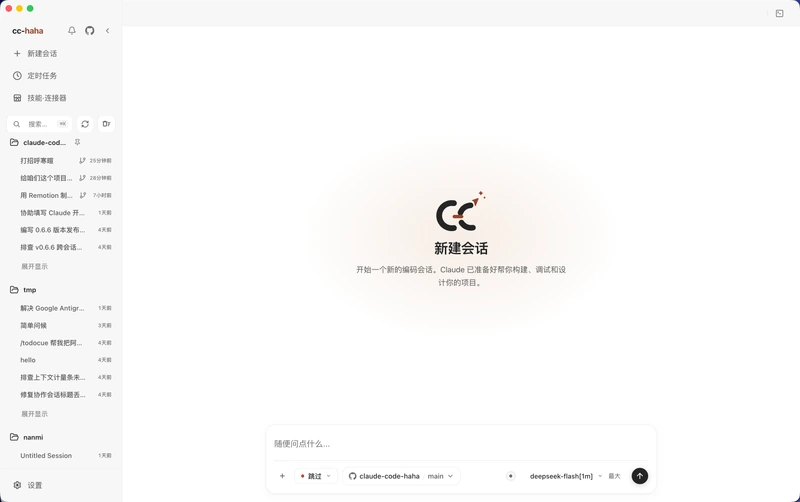
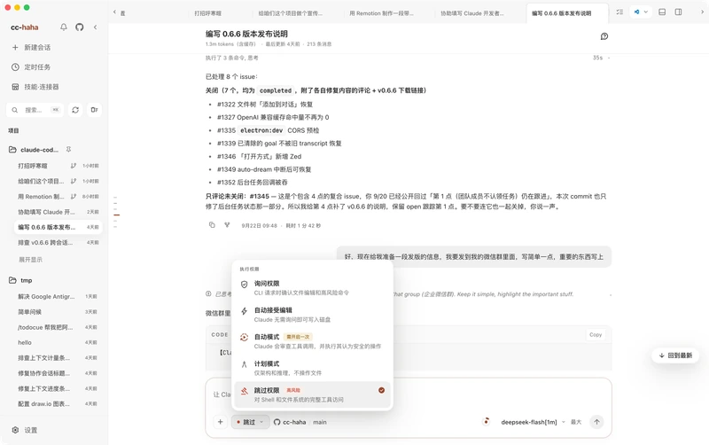
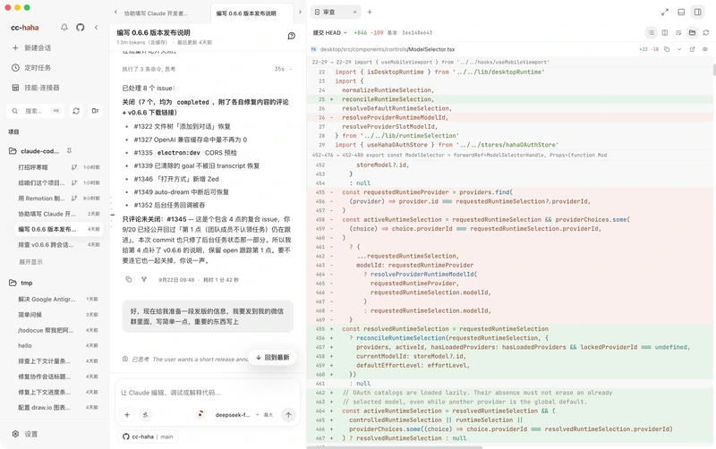
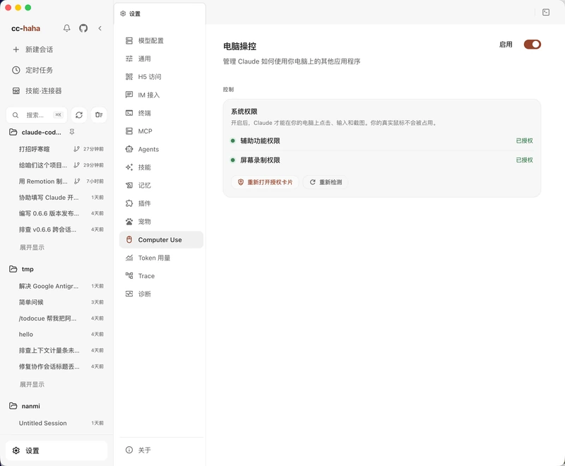
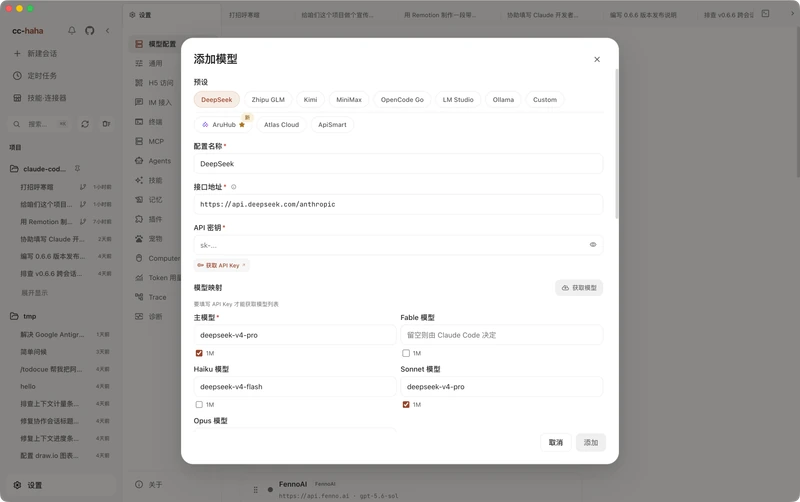
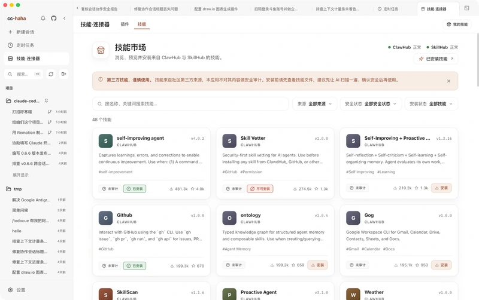
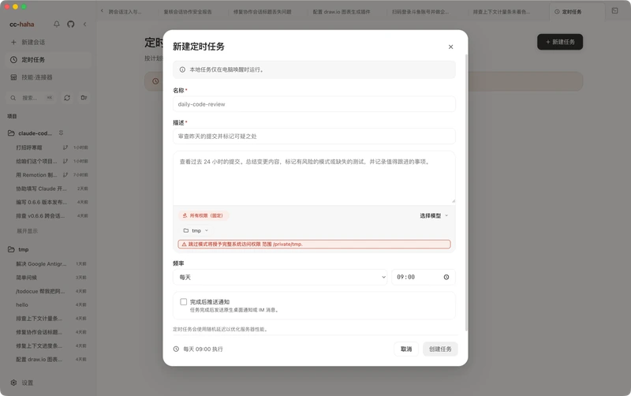
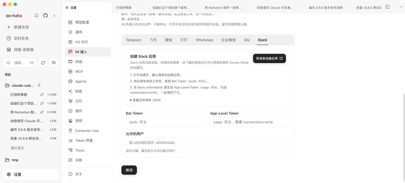

# ccmax

<p align="center">
  <picture>
    <source media="(prefers-color-scheme: dark)" srcset="docs/images/logo-horizontal-dark.png">
    
  </picture>
</p>

<div align="center">

[](https://github.com/yaogjim/ccmax/stargazers)
[](https://github.com/yaogjim/ccmax/network/members)
[](https://github.com/yaogjim/ccmax/issues)
[](https://github.com/yaogjim/ccmax/pulls)
[](https://github.com/yaogjim/ccmax/blob/main/LICENSE)
[](README.md)
[](README.zh-CN.md)
[](https://yaogjim.github.io/ccmax)

[简体中文](README.zh-CN.md) · **English**

</div>

ccmax is a **desktop Claude Code workspace** for macOS, Windows, and Linux: multi-session workspaces, global search, branch / Worktree launch, diff review, built-in browser preview, GUI permission approval, any model — Claude, ChatGPT, Grok, presets, or local endpoints — image generation, visual MCP & SubAgent managers, an Agent Teams workbench, dynamic Workflow orchestration, model trace, Computer Use, skill marketplace, colour themes, desktop pets, H5 remote access, IM integration, and scheduled tasks, all in one app.

<p align="center">
  <a href="#desktop-preview">Desktop Preview</a> · <a href="#install-the-desktop-app">Install</a> · <a href="#desktop-highlights">Highlights</a> · <a href="#more-documentation">More Docs</a> · <a href="#sponsorship--partnership">Sponsorship</a> · <a href="#user-group">User Group</a>
</p>

---

## Desktop Preview

<p align="center">
  <a href="https://github.com/yaogjim/ccmax/releases"></a>
</p>

The top row covers **getting started and daily work**: sessions, permissions, changes, and Computer Use. The second shows **extensions**: models, skills, scheduled tasks, and IM. These screenshots show the real project in the Chinese interface. Click a thumbnail to see the full screen.

<table>
  <tr>
    <td align="center" valign="top" width="25%"><a href="docs/images/app/en/session-new.webp"></a><br><b>01 · Start a session</b><br>Pick a project and permissions</td>
    <td align="center" valign="top" width="25%"><a href="docs/images/app/en/permission-modes.webp"></a><br><b>02 · Set permissions</b><br>Control what each task can do</td>
    <td align="center" valign="top" width="25%"><a href="docs/images/app/en/workspace-diff.webp"></a><br><b>03 · Review changes</b><br>Inspect each file's diff</td>
    <td align="center" valign="top" width="25%"><a href="docs/images/app/en/settings-computer-use.webp"></a><br><b>04 · Computer Use</b><br>Keep your Mac mouse and keyboard free</td>
  </tr>
  <tr>
    <td align="center" valign="top" width="25%"><a href="docs/images/app/en/settings-provider-add.webp"></a><br><b>05 · Connect models</b><br>Use presets or local endpoints</td>
    <td align="center" valign="top" width="25%"><a href="docs/images/app/en/skill-market.webp"></a><br><b>06 · Add skills</b><br>Install what a task needs</td>
    <td align="center" valign="top" width="25%"><a href="docs/images/app/en/schedule-create.webp"></a><br><b>07 · Schedule tasks</b><br>Automate recurring work</td>
    <td align="center" valign="top" width="25%"><a href="docs/images/app/en/settings-im.webp"></a><br><b>08 · Work remotely</b><br>Continue through IM</td>
  </tr>
</table>

Start here: [install the app](docs/en/start/install.md) → [connect a model](docs/en/start/models.md) → [run your first session](docs/en/start/first-session.md) → [explore settings](docs/en/desktop/settings.md) → [try real workflows](docs/en/cases/index.md). For hands-free cross-app work on macOS, follow the [Computer Use guide](docs/en/desktop/computer-use.md).

---

## Sponsorship & Partnership

This project is maintained in the author's spare time. Corporate or individual sponsorships are welcome to support ongoing development. Custom features, integrations, and business partnerships are also open for discussion.

<table>
  <thead>
    <tr>
      <th width="220">Sponsor</th>
      <th align="left">Description</th>
    </tr>
  </thead>
  <tbody>
    <tr>
      <td align="center" valign="middle">
        <a href="https://aruhub.com/sign-up?aff=Z54g">
          
        </a>
      </td>
      <td valign="middle">
        Thanks to <a href="https://aruhub.com/sign-up?aff=Z54g">AruHub</a> for sponsoring this project! AruHub focuses on providing developers with a stable, long-term primary API upstream service. Built for high-frequency AI coding workflows such as Codex and Claude Code, it offers official GPT API access through enterprise groups and stable Claude enterprise groups for sustained use, with support for leading models including GPT and Claude. Image 2 / 2.5 is available around the clock, starting at CNY 0.04 per image. Pay-as-you-go billing supports high-volume enterprise usage, invoicing, and refunds. Register through the <a href="https://aruhub.com/sign-up?aff=Z54g">exclusive link</a> to receive US$1 in credit usable across all models, with no model restrictions.
      </td>
    </tr>
    <tr>
      <td align="center" valign="middle">
        <a href="https://www.atlascloud.ai/?utm_source=github&utm_medium=link&utm_campaign=ccmax">
          
          
        </a>
      </td>
      <td valign="middle">
        Thanks to <a href="https://www.atlascloud.ai/?utm_source=github&utm_medium=link&utm_campaign=ccmax">Atlas Cloud</a> for sponsoring this project. Atlas Cloud is a full-modal AI inference platform that gives developers a single AI API to access video generation, image generation, and LLM APIs. Instead of managing multiple vendor integrations, you connect once and get unified access to 300+ curated models across all modalities. Atlas Cloud is already built into the ccmax provider list, so you can pick it in settings and start using it with just an API key. Check out Atlas Cloud's new <a href="https://www.atlascloud.ai/console/coding-plan">coding plan promotion</a> for more budget-friendly API access.
      </td>
    </tr>
    <tr>
      <td align="center" valign="middle">
        <a href="https://www.apismart.ai">
          
        </a>
      </td>
      <td valign="middle">
        Thanks to <a href="https://www.apismart.ai">ApiSmart</a> for sponsoring this project. ApiSmart provides unified access to leading AI models through a single API. Use one API key to connect with LLM, image, and video models through an OpenAI-compatible interface. Easily switch between models, simplify billing, and improve reliability with intelligent routing and automatic failover.
      </td>
    </tr>
  </tbody>
</table>

📧 **Contact**: relakkes@gmail.com

---

## Install the Desktop App

1. Download the macOS / Windows / Linux desktop installer from [Releases](https://github.com/yaogjim/ccmax/releases).
2. On first launch, configure your model provider, API key, and default model in Settings.
3. Public macOS releases require signing and notarization. Draft or unsigned temporary builds may still need one-time manual approval. Unsigned Windows installers may show SmartScreen; click "More info" -> "Run anyway". See the [desktop installation guide](docs/en/start/install.md).

Release trust and privacy: [Code signing policy](docs/en/start/code-signing.md) · [Privacy and network access](docs/en/start/privacy.md)

## Run the CLI from Source

For users who want to debug the underlying CLI, server, or local development flow:

```bash
bun install
cp .env.example .env
./bin/ccmax
```

See [environment variables](docs/en/cli/env.md) and [CLI setup](docs/en/cli/index.md) for more configuration options.

---

## User Group

Scan the QR code below to join the ccmax user group on WeCom (WeChat Work) — the conversation there is mostly in Chinese. For questions and bug reports in English, [Issues](https://github.com/yaogjim/ccmax/issues) is the better place. For enterprise deployment, customization, or Agent development needs, contact the author [yaogjim](https://github.com/yaogjim).

<p align="center">
  
</p>

---

## ☕ Buy Me a Coffee

If this project helps you, consider buying me a coffee — every bit of support keeps this project going ❤️

<table>
<tr>
<td align="center" width="33%">
<br>
<b>WeChat Pay</b>
</td>
<td align="center" width="33%">
<br>
<b>Alipay</b>
</td>
<td align="center" width="33%">
<a href="https://buymeacoffee.com/relakkes" target="_blank">

</a><br>
<b>Buy Me a Coffee</b>
</td>
</tr>
</table>

---

## Desktop Highlights

- **Multi-session workspace**: tabs, project switching, terminal entry, and session history in one place, with a resizable sidebar.
- **Global search**: press Cmd+K to search across every session and jump to the match.
- **Branch / Worktree launch**: choose a repository branch and decide whether to use the current working tree or an isolated Worktree.
- **Review edits file by file**: the workspace lists this turn's changes; open any file for a syntax-highlighted diff, or undo the whole turn.
- **Built-in browser preview**: the page your agent just edited renders right inside the app, cookies and login state included.
- **Five permission modes**: from "ask every time" to "skip permissions" — risky commands, tool calls, and follow-up questions are all approved in the GUI.
- **Bring your own model**: sign in to Claude, ChatGPT, or Grok; use presets for DeepSeek, Kimi, Zhipu GLM and others; or point it at LM Studio and Ollama running locally.
- **Image generation**: generate and edit images right in the chat — sign in with ChatGPT or Grok for instant use, or plug in any OpenAI-compatible Images API.
- **Visual MCP manager**: add and edit MCP servers in a GUI — STDIO / Streamable HTTP / SSE, with project, shared, or global scope.
- **Six colour themes**: white, paper, warm classic, celadon, ink night, and ink blue — optionally following your system's light/dark setting.
- **Skill marketplace**: discover, preview, and install third-party skills from ClawHub / SkillHub, with source and safety status shown up front.
- **Session activity panel**: track task progress, background tasks, SubAgents, and sources in one side panel.
- **Visual SubAgent manager**: create and tune SubAgents in a GUI — model, tools, and permission mode.
- **Agent Teams workbench**: visualize multi-agent collaboration in the GUI — members, tasks, a communication feed, and a dependency-lane canvas.
- **Dynamic Workflow orchestration**: the model writes and runs orchestration scripts on the fly, driving subagents concurrently or in pipelines, with phase views, interrupts, and resume.
- **Model trace**: every model request is logged locally with status and timing — search and filter to diagnose stuck or failed calls.
- **Computer Use**: let the agent take screenshots, click, type, and control desktop apps after authorization; the native macOS runtime does not take over your physical mouse or keyboard.
- **Desktop pets**: Dada, Huhu, Bubu, and Huihui change what they do with the task at hand — or raise one of your own (off by default).
- **H5 remote access**: scan a QR code to continue the session in your phone browser; locking the screen won't kill a running task.
- **IM integration**: chat, switch projects, and approve actions through Telegram / Feishu / WeChat / DingTalk / WhatsApp / WeCom / QQ / Slack.
- **Scheduled tasks and usage stats**: run planned tasks in their own sessions and track local token usage trends.

---

## More Documentation

Full documentation site: <https://yaogjim.github.io/ccmax>

| Section | Documents |
|------|------|
| **Getting started** | [What this is](docs/en/start/index.md) · [Download and install](docs/en/start/install.md) · [Connect a model provider](docs/en/start/models.md) · [Your first session](docs/en/start/first-session.md) · [Troubleshooting](docs/en/start/troubleshooting.md) |
| **Desktop features** | [Feature overview](docs/en/desktop/index.md) · [Computer Use](docs/en/desktop/computer-use.md) · [Desktop pets](docs/en/desktop/pets.md) · [Phone H5 and IM relay](docs/en/desktop/remote.md) |
| **IM integrations** | [Overview and pairing](docs/en/im/index.md) · [Feishu](docs/en/im/feishu.md) · [Telegram](docs/en/im/telegram.md) · [WeChat](docs/en/im/wechat.md) · [DingTalk](docs/en/im/dingtalk.md) · [WhatsApp](docs/en/im/whatsapp.md) · [WeCom](docs/en/im/wecom.md) · [QQ](docs/en/im/qq.md) · [Slack](docs/en/im/slack.md) |
| **CLI** | [Install and run](docs/en/cli/index.md) · [Command reference](docs/en/cli/reference.md) · [Environment variables](docs/en/cli/env.md) |
| **Internals** | [Desktop architecture](docs/en/internals/desktop.md) · [Multi-agent system](docs/en/internals/agent.md) · [Skills system](docs/en/internals/skills.md) · [Memory system](docs/en/internals/memory.md) · [Computer Use architecture](docs/en/internals/computer-use.md) · [Local server and API](docs/en/internals/server.md) · [Channel system](docs/en/internals/channel.md) · [Project structure](docs/en/internals/structure.md) · [Contributing and quality gates](docs/en/internals/contributing.md) |

---

## Tech Stack

| Category | Technology |
|------|------|
| Language | TypeScript |
| Desktop app | Electron |
| Desktop UI | React + Vite |
| Local runtime | [Bun](https://bun.sh) |
| Terminal UI | React + [Ink](https://github.com/vadimdemedes/ink) |
| CLI parsing | Commander.js |
| API | Anthropic SDK |
| Protocols | MCP, LSP |

## Acknowledgements

Thanks to the following open-source projects and community practices for reference and inspiration:

- [React](https://github.com/facebook/react): frontend engineering and component-based UI ecosystem.
- [Electron](https://github.com/electron/electron): cross-platform desktop app capabilities and engineering practices.
- [cc-switch](https://github.com/farion1231/cc-switch): reference for model provider configuration.
- [LINUX DO](https://linux.do/): a new ideal developer community.

---

## ⭐ Star History

If this project helps you, please support it with a ⭐ Star so more people can discover ccmax.

<a href="https://www.repostars.dev/?repos=yaogjim%2Fccmax&theme=ocean">
  
</a>
