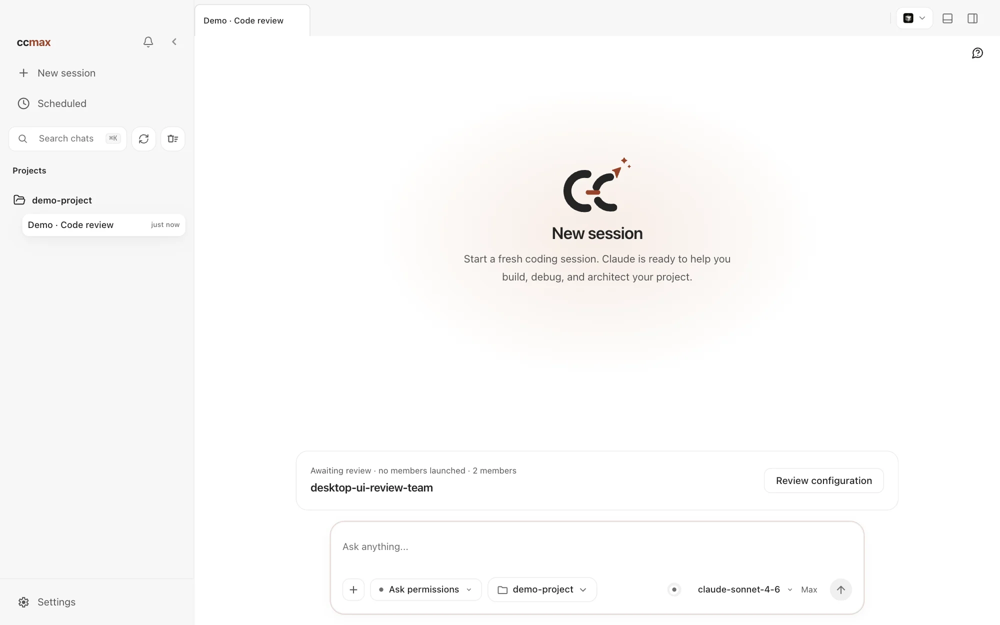
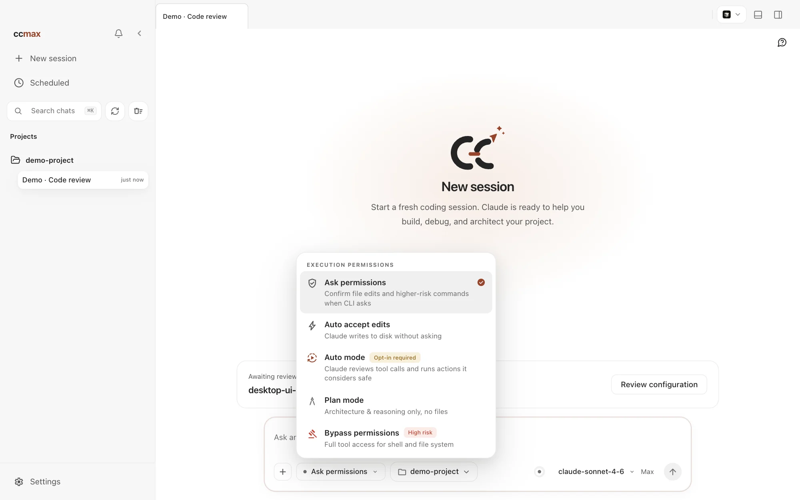
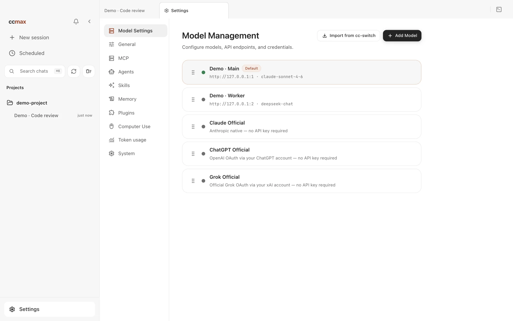
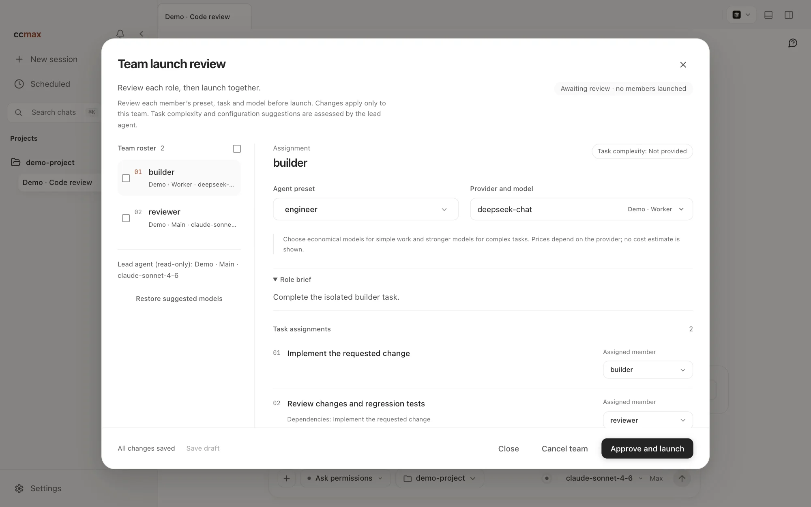
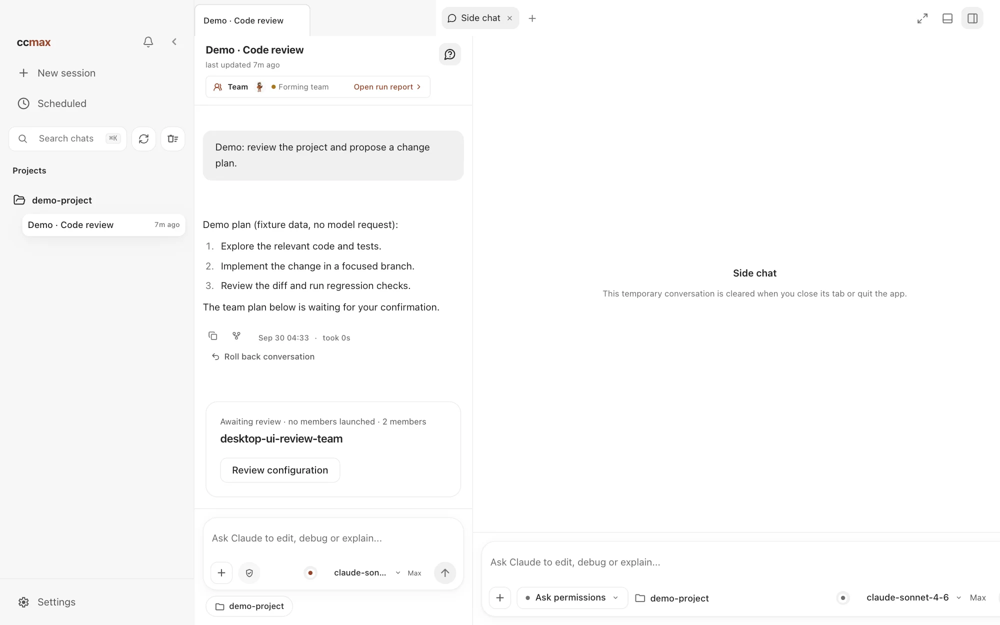
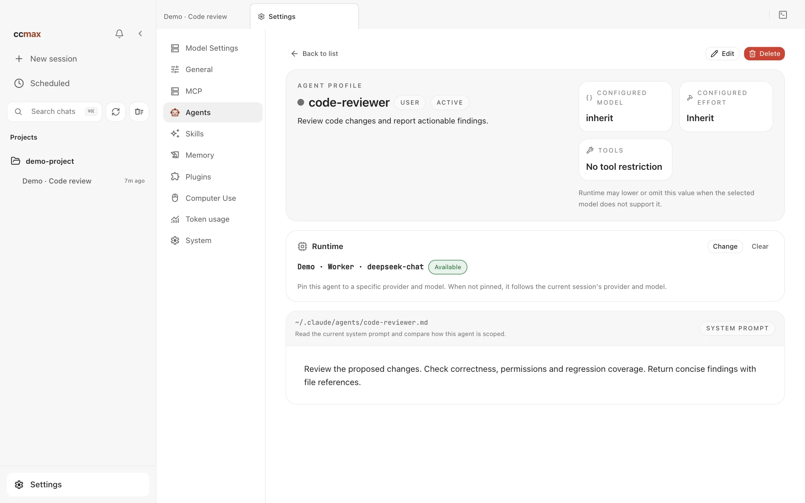
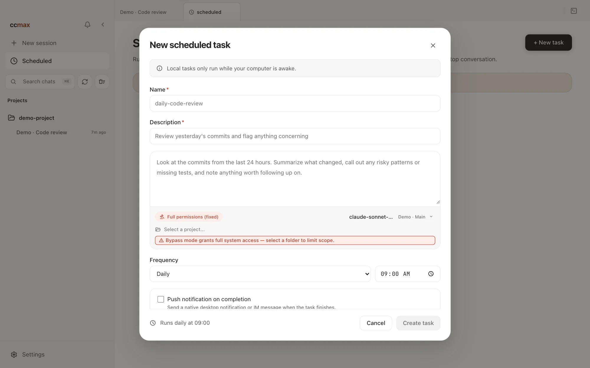
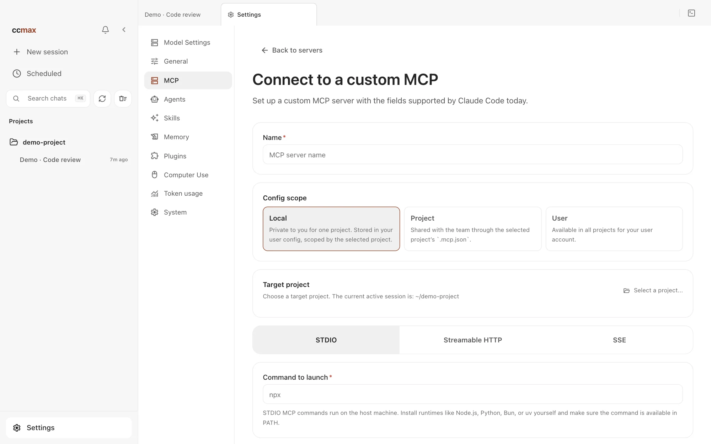
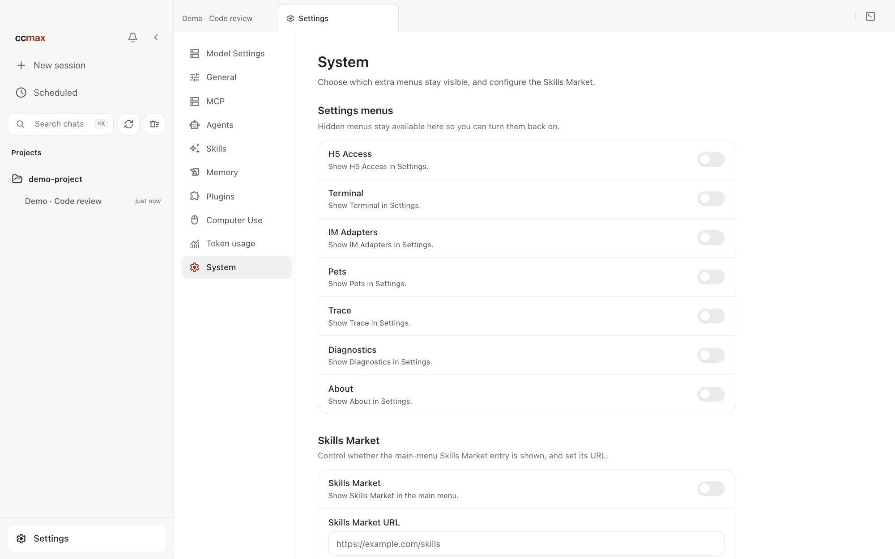

# ccmax

<p align="center">
  <picture>
    <source media="(prefers-color-scheme: dark)" srcset="docs/images/logo-horizontal-dark.png">
    
  </picture>
</p>

<div align="center">

[](LICENSE)
[](README.md)
[](README.zh-CN.md)
[](https://yaogjim.github.io/ccmax)

[简体中文](README.zh-CN.md) · **English**

</div>

ccmax is a **desktop AI coding workbench** built on Claude Code: it brings projects and multi-session work, code review, model providers, multi-agent collaboration, and local automation into one Electron app, with a CLI and a local server alongside. The source supports macOS, Windows, and Linux.

> **Source vs. release.** This page describes what the current source tree can do. **v0.7.0** includes dedicated provider and model bindings for individual agents and ships a macOS Apple Silicon installer only; other platforms can be built from source. Installation scope and signing are covered below.

<p align="center">
  <a href="#desktop-preview">Desktop Preview</a> · <a href="#install-the-desktop-app">Install</a> · <a href="#desktop-highlights">Desktop Highlights</a> · <a href="#more-documentation">More Documentation</a>
</p>

---

## Desktop Preview

These screenshots come from a production build of the current source frontend, using an isolated demo project and configuration — no real account or real model execution is shown. The Chinese and English READMEs each show the interface in their own language, and clicking an image opens the full 2000-pixel-wide capture.

<table>
  <tr>
    <td align="center" valign="top" width="33%">
      <a href="docs/images/app/en/readme-session-new.webp"></a>
      <br><b>01 · Session workbench</b><br>Project, permissions, and model in one place.
    </td>
    <td align="center" valign="top" width="33%">
      <a href="docs/images/app/en/readme-permission-modes.webp"></a>
      <br><b>02 · Choose permissions</b><br>Pick the execution permissions for the task.
    </td>
    <td align="center" valign="top" width="33%">
      <a href="docs/images/app/en/readme-models.webp"></a>
      <br><b>03 · Manage models</b><br>Official accounts, custom APIs, and local endpoints.
    </td>
  </tr>
  <tr>
    <td align="center" valign="top" width="33%">
      <a href="docs/images/app/en/readme-team-plan.webp"></a>
      <br><b>04 · Confirm the team plan</b><br>Check members and tasks, then start the run.
    </td>
    <td align="center" valign="top" width="33%">
      <a href="docs/images/app/en/readme-side-chat.webp"></a>
      <br><b>05 · Ask on the side</b><br>Inherits the context; a follow-up that does not interrupt the main task.
    </td>
    <td align="center" valign="top" width="33%">
      <a href="docs/images/app/en/readme-agent-runtime.webp"></a>
      <br><b>06 · Agent-specific model</b><br>An optional pinned provider and model.
    </td>
  </tr>
  <tr>
    <td align="center" valign="top" width="33%">
      <a href="docs/images/app/en/readme-scheduled-tasks.webp"></a>
      <br><b>07 · Local scheduled tasks</b><br>Scheduled runs, run history, and notifications.
    </td>
    <td align="center" valign="top" width="33%">
      <a href="docs/images/app/en/readme-mcp.webp"></a>
      <br><b>08 · Manage MCP servers</b><br>Configure external tool servers in the GUI.
    </td>
    <td align="center" valign="top" width="33%">
      <a href="docs/images/app/en/readme-system.webp"></a>
      <br><b>09 · System settings</b><br>Show entries on demand and set a custom marketplace URL.
    </td>
  </tr>
</table>

Start here: [install the app](docs/en/start/install.md) → [connect a model](docs/en/start/models.md) → [run your first session](docs/en/start/first-session.md) → [explore settings](docs/en/desktop/settings.md) → [try real workflows](docs/en/cases/index.md). For cross-app work, follow the [Computer Use guide](docs/en/desktop/computer-use.md).

---

## Install the Desktop App

The latest release, **v0.7.0**, ships a **macOS Apple Silicon (ARM64)** installer only, requiring macOS 12.0 or later; the native Computer Use helper requires macOS 14.4 or later. There is no Windows, Linux, or Intel Mac build for this release; for other platforms, build from source as described in the [contributing guide](docs/en/internals/contributing.md).

1. Download `ccmax-0.7.0-mac-arm64.dmg` and `install-macos-unsigned.sh` from the Assets of the v0.7.0 [release](https://github.com/yaogjim/ccmax/releases).
2. Put the script in the same folder as the DMG and run `bash install-macos-unsigned.sh`. It installs the app, removes the quarantine attribute, and launches it.
3. Manual alternative: install the DMG as usual, then run `xattr -dr com.apple.quarantine /Applications/ccmax.app` before opening the app.
4. On first launch, sign in to an official account under Settings → Models, or configure a provider, API key, and default model.

**About signing.** The v0.7.0 build of this branch uses a local self-signed certificate. It is not signed with an Apple Developer ID and is not notarized, so the first launch may be blocked with a "damaged" or "cannot verify developer" warning. Only after confirming that the installer and script come from a trusted source should you clear the quarantine attribute as above.

Release notes: [v0.7.0](release-notes/v0.7.0.md) · [Code signing policy](docs/en/start/code-signing.md) · [Privacy and network access](docs/en/start/privacy.md)

## Run the CLI from Source

For debugging the underlying CLI, server, or local development flow:

```bash
bun install
cp .env.example .env
./bin/ccmax
```

See [environment variables](docs/en/cli/env.md), [CLI setup](docs/en/cli/index.md), and [contributing](docs/en/internals/contributing.md) for more configuration options.

---

## Desktop Highlights

### Daily workspace

- **Multi-session and project management** — tabs, project switching, a terminal entry, and session history in one window, with a resizable sidebar. See [sessions, permissions, and review](docs/en/desktop/sessions.md).
- **Global search** — press Cmd+K to search across sessions and jump straight to the match.
- **Branch / Worktree launch** — start a session on a repository branch, on the current working tree or in an isolated Git worktree.
- **Review changes file by file** — the workspace lists this turn's changes, with syntax-highlighted diffs, line comments, and a whole-turn undo. See [workspace](docs/en/desktop/workspace.md).
- **Built-in browser preview** — view the page you are building inside the app, using the cookies and login state of a separate browser.
- **Five permission modes** — pick permissions per task; tool calls, risky operations, and pending questions are handled in the GUI.

### Collaboration and automation

- **Agent Teams team plan** — before a run starts, the app shows members, agent presets, providers, models, task ownership, and dependencies; you can adjust them individually or in bulk and the team starts only after you confirm. The workbench shows members, tasks, and communication, and can stop the whole team. See [agents](docs/en/desktop/agents.md).
- **Cross-session references and collaboration** — reference an earlier session with `@` as context, and let agents dispatch work, read results from other sessions, and exchange messages. Messages between agents never count as user authorization.
- **Side chats** — type `/btw <question>`, or select text and ask in the side chat. The temporary thread inherits the parent session's context and model, runs independently, and does not interrupt the main task; it is cleared when you close that tab or quit the app.
- **Visual agent management** — browse, create, and edit subagents, configuring the system prompt, tools, model, and reasoning effort, and adjust the model of built-in agents. See [subagents and task splitting](docs/en/desktop/agents.md).
- **Agent-specific provider and model** — you can pin a runtime to an individual agent without affecting the main session. If the pinned runtime becomes unavailable it fails with an explicit error instead of switching providers. This applies to desktop app sessions only; one parent session runs at most three pinned agents at a time, they share a single working directory, and pinned agents do not support resuming the conversation or an isolated Worktree. Task content is sent to the provider you choose, so confirm you trust it before configuring. Team-plan members still use the runtime confirmed in their plan.
- **Local scheduled tasks** — create and manage tasks from the UI or in natural language, view run history, stop a running execution, and clear finished records after confirmation; notifications can go to the desktop or to an authorized Telegram / Feishu target. Tasks trigger only while the desktop app keeps running. See [scheduled tasks](docs/en/desktop/schedule.md).
- **Dynamic Workflow orchestration** — the model writes and runs orchestration scripts, driving subagents concurrently or in pipelines, with phase views, interrupts, and resume.
- **Computer Use** — after authorization, let the agent take screenshots, click, type, and control desktop apps; on macOS the native runtime does not occupy your real mouse and keyboard. See [Computer Use](docs/en/desktop/computer-use.md).

### Models, extensions and preferences

- **Bring your own model** — sign in to Claude / ChatGPT / Grok official accounts, use third-party API presets, add a custom endpoint, or point at local LM Studio / Ollama. See [connect a model provider](docs/en/start/models.md).
- **Image generation and editing** — use a configured image service in chat, through an official account or a compatible Images API.
- **MCP management in the GUI** — manage external tool servers over STDIO / Streamable HTTP / SSE, scoped to a project, shared, or global.
- **Skills and plugins** — browse, preview, and install extensions with their source and safety status shown; the marketplace entry and address are adjustable in System settings.
- **Request trace and usage stats** — inspect the status, duration, and token-usage trends of local model requests to diagnose failing calls.
- **System settings** — centrally control the Terminal, IM access, Pets, Trace, Diagnostics, About, H5 access, and sidebar skill-marketplace entries; these optional entries are hidden by default and enabled as needed.
- **Six themes and chat appearance** — white, paper, warm classic, celadon, ink night, and ink blue, optionally following the system light/dark setting; chat font, font size, and conversation width are adjusted separately.
- **Optional timed auto-answer** — when enabled, questions waiting on a user answer past the configured duration can be decided by the session's small model based on context; you can still handle them manually at any time. See [settings](docs/en/desktop/settings.md).
- **Desktop pets** — built-in pets change their actions with the task state, and you can create your own; off by default. See [desktop pets](docs/en/desktop/pets.md).
- **Phone and IM relay** — H5 access from a phone browser, plus remote chat, project switching, and permission approval through Telegram / Feishu / WeChat / DingTalk / WhatsApp / WeCom / QQ / Slack. See [remote access](docs/en/desktop/remote.md) and [IM integrations](docs/en/im/index.md).

---

## More Documentation

Full documentation site: <https://yaogjim.github.io/ccmax>

- **Getting started** — [What ccmax is](docs/en/start/index.md) · [Download and install](docs/en/start/install.md) · [Connect a model provider](docs/en/start/models.md) · [Your first session](docs/en/start/first-session.md) · [Troubleshooting](docs/en/start/troubleshooting.md)
- **Desktop features** — [Feature overview](docs/en/desktop/index.md) · [Sessions and permissions](docs/en/desktop/sessions.md) · [Workspace](docs/en/desktop/workspace.md) · [Agents](docs/en/desktop/agents.md) · [Scheduled tasks](docs/en/desktop/schedule.md) · [Settings](docs/en/desktop/settings.md) · [Computer Use](docs/en/desktop/computer-use.md) · [Desktop pets](docs/en/desktop/pets.md) · [Phone H5 and IM relay](docs/en/desktop/remote.md)
- **Real workflows** — [Case library](docs/en/cases/index.md) · [Fix a bug](docs/en/cases/fix-bug.md) · [Ship a feature](docs/en/cases/ship-feature.md) · [Daily review](docs/en/cases/daily-review.md) · [Explore a project](docs/en/cases/explore-project.md) · [Hand off to your phone](docs/en/cases/phone-handoff.md)
- **IM integrations** — [Overview and pairing](docs/en/im/index.md) · [Feishu](docs/en/im/feishu.md) · [Telegram](docs/en/im/telegram.md) · [WeChat](docs/en/im/wechat.md) · [DingTalk](docs/en/im/dingtalk.md) · [WhatsApp](docs/en/im/whatsapp.md) · [WeCom](docs/en/im/wecom.md) · [QQ](docs/en/im/qq.md) · [Slack](docs/en/im/slack.md)
- **CLI** — [Install and run](docs/en/cli/index.md) · [Command reference](docs/en/cli/reference.md) · [Environment variables](docs/en/cli/env.md)
- **Internals** — [Desktop architecture](docs/en/internals/desktop.md) · [Multi-agent system](docs/en/internals/agent.md) · [Skills system](docs/en/internals/skills.md) · [Memory system](docs/en/internals/memory.md) · [Computer Use architecture](docs/en/internals/computer-use.md) · [Local server and API](docs/en/internals/server.md) · [Channel system](docs/en/internals/channel.md) · [Project structure](docs/en/internals/structure.md) · [Contributing and quality gates](docs/en/internals/contributing.md)

---

## Tech Stack

- **Language** — TypeScript
- **Desktop app** — Electron
- **Desktop UI** — React + Vite
- **Local runtime** — [Bun](https://bun.sh)
- **Terminal UI** — React + [Ink](https://github.com/vadimdemedes/ink)
- **CLI parsing** — Commander.js
- **API** — Anthropic SDK
- **Protocols** — MCP, LSP

---

## License

Released under the [MIT License](LICENSE).