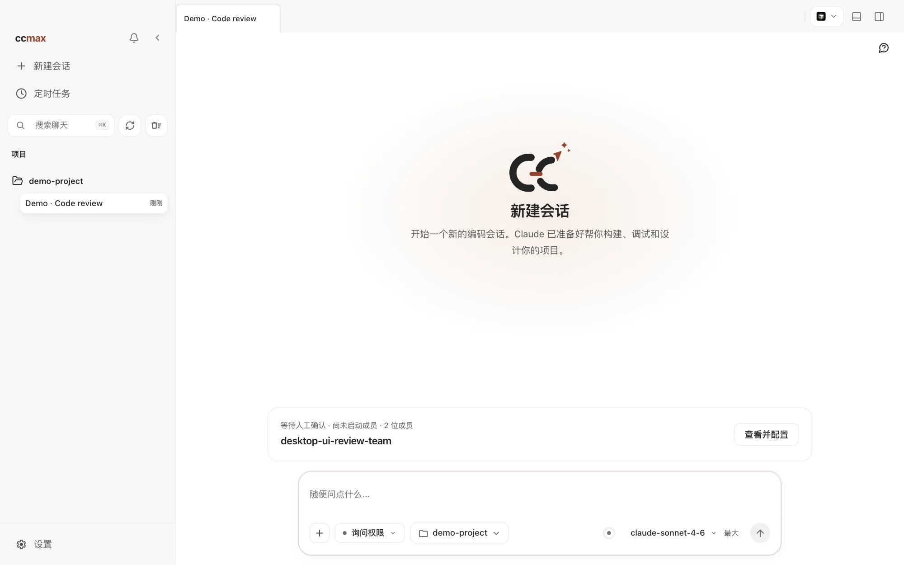
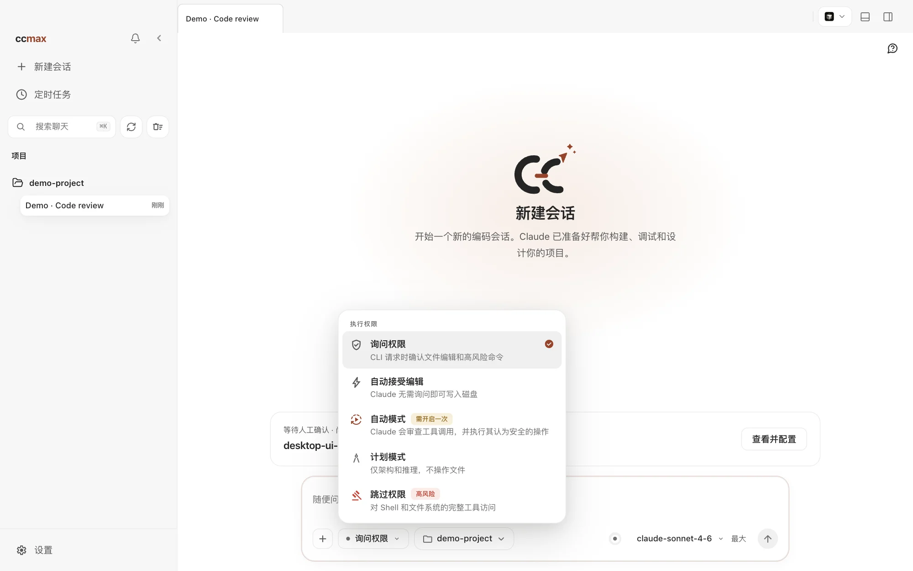
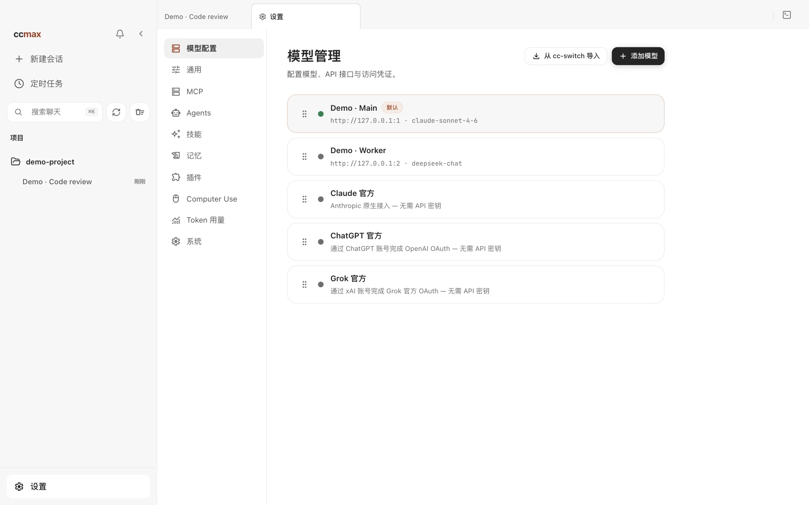
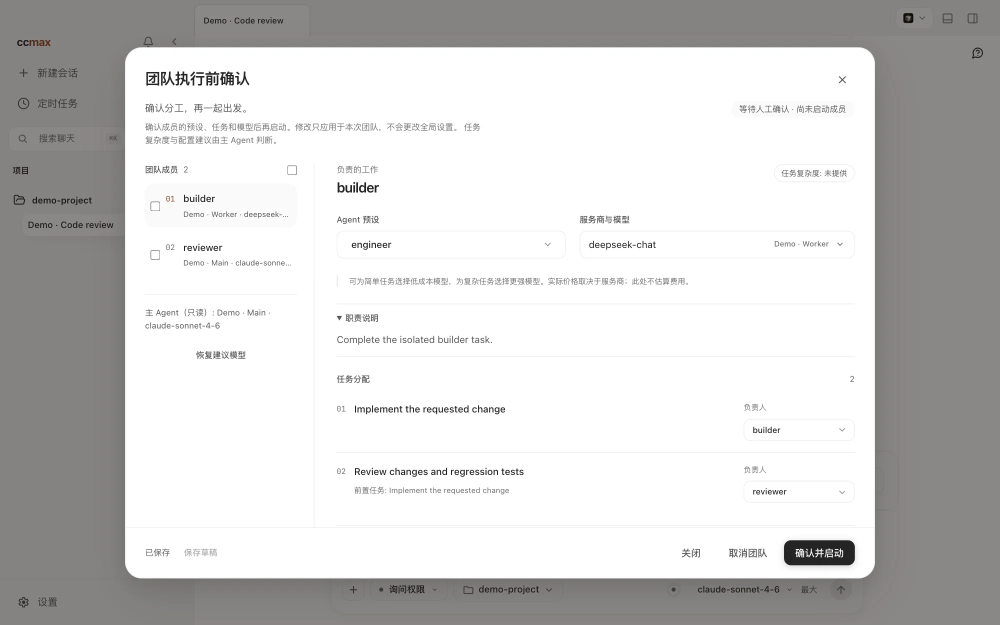
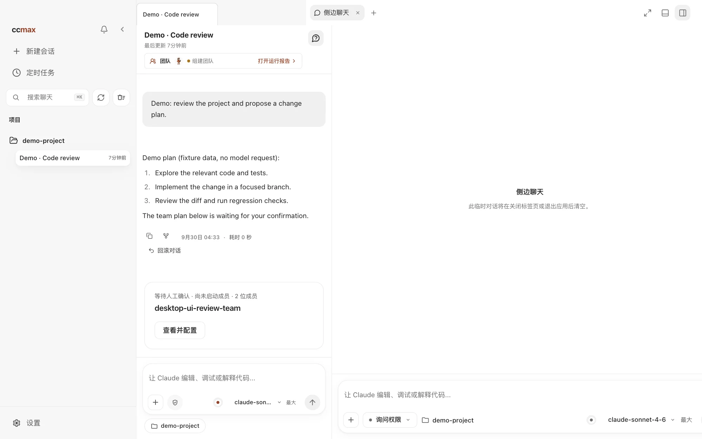
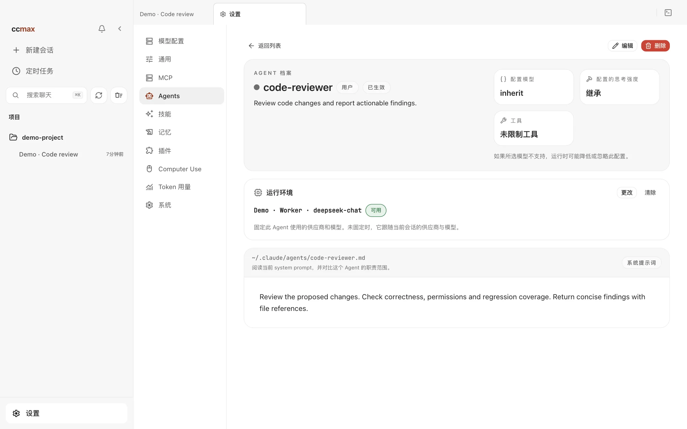
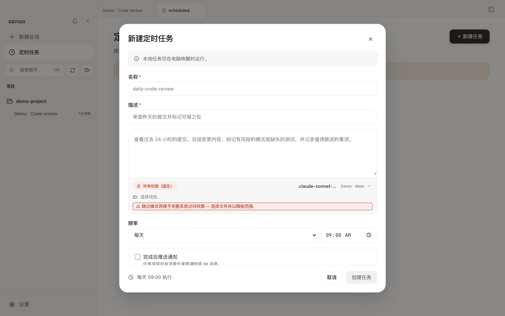
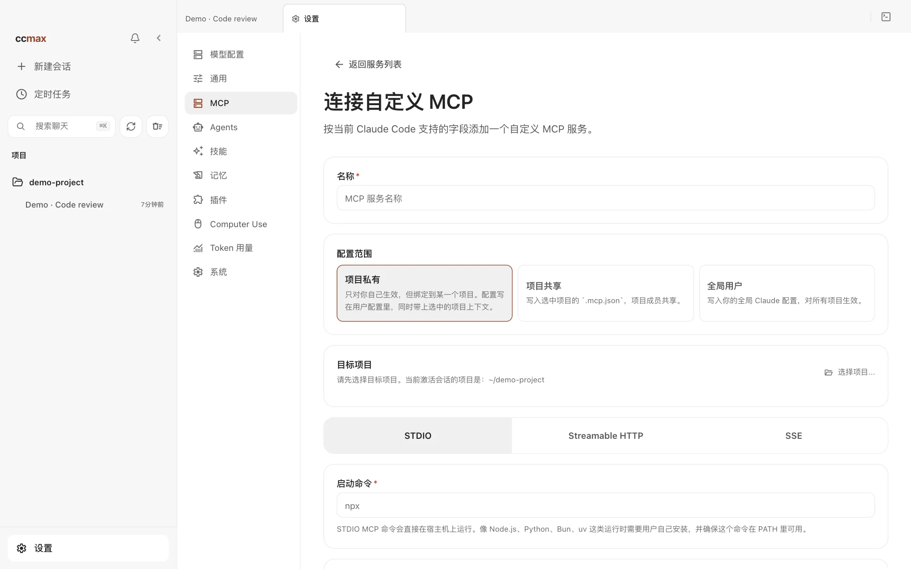
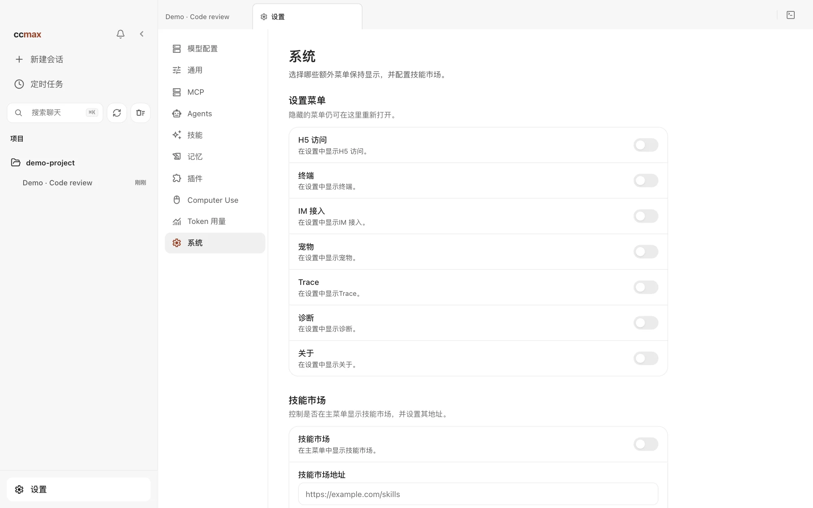

# ccmax

<p align="center">
  <picture>
    <source media="(prefers-color-scheme: dark)" srcset="docs/images/logo-horizontal-dark.png">
    
  </picture>
</p>

<div align="center">

[](LICENSE)
[](README.zh-CN.md)
[](README.md)
[](https://yaogjim.github.io/ccmax)

**简体中文** · [English](README.md)

</div>

ccmax 是一个**桌面端 AI 编程工作台**，基于 Claude Code，把项目与多会话、代码审阅、模型接入、多 Agent 协作和本地自动化集中在一个 Electron 应用中，同时提供 CLI 和本地服务。源码支持 macOS、Windows 与 Linux。

> **源码与发布包**：本文介绍当前源码的功能。**v0.7.0** 包含单个 Agent 的专属供应商与模型绑定，仅提供 macOS Apple Silicon 安装包；其他平台可从源码构建。安装范围和签名情况见下方说明。

<p align="center">
  <a href="#桌面端预览">桌面端预览</a> · <a href="#安装桌面端">安装桌面端</a> · <a href="#桌面端亮点">桌面端亮点</a> · <a href="#更多文档">更多文档</a>
</p>

---

## 桌面端预览

以下截图来自当前源码的前端生产构建，使用隔离的演示项目与配置，不展示真实账号或真实模型执行结果。中文、英文 README 分别展示对应语言的界面，点击图片可查看 2000 像素宽的完整截图。

<table>
  <tr>
    <td align="center" valign="top" width="33%">
      <a href="docs/images/app/zh-CN/readme-session-new.webp"></a>
      <br><b>01 · 会话工作台</b><br>项目、权限和模型集中选择
    </td>
    <td align="center" valign="top" width="33%">
      <a href="docs/images/app/zh-CN/readme-permission-modes.webp"></a>
      <br><b>02 · 选择权限</b><br>按任务选择执行权限
    </td>
    <td align="center" valign="top" width="33%">
      <a href="docs/images/app/zh-CN/readme-models.webp"></a>
      <br><b>03 · 模型管理</b><br>官方账号、自定义 API 与本地端点
    </td>
  </tr>
  <tr>
    <td align="center" valign="top" width="33%">
      <a href="docs/images/app/zh-CN/readme-team-plan.webp"></a>
      <br><b>04 · 确认团队计划</b><br>先检查成员和任务，再启动执行
    </td>
    <td align="center" valign="top" width="33%">
      <a href="docs/images/app/zh-CN/readme-side-chat.webp"></a>
      <br><b>05 · 侧边问答</b><br>继承上下文，追问不打断主任务
    </td>
    <td align="center" valign="top" width="33%">
      <a href="docs/images/app/zh-CN/readme-agent-runtime.webp"></a>
      <br><b>06 · Agent 专属模型</b><br>可选固定供应商与模型
    </td>
  </tr>
  <tr>
    <td align="center" valign="top" width="33%">
      <a href="docs/images/app/zh-CN/readme-scheduled-tasks.webp"></a>
      <br><b>07 · 本地定时任务</b><br>计划执行、运行记录与通知
    </td>
    <td align="center" valign="top" width="33%">
      <a href="docs/images/app/zh-CN/readme-mcp.webp"></a>
      <br><b>08 · MCP 管理</b><br>图形化配置外部工具服务
    </td>
    <td align="center" valign="top" width="33%">
      <a href="docs/images/app/zh-CN/readme-system.webp"></a>
      <br><b>09 · 系统设置</b><br>按需显示入口，自定义技能市场地址
    </td>
  </tr>
</table>

从 0 开始：[下载安装](docs/start/install.md) → [连接模型](docs/start/models.md) → [跑通第一条会话](docs/start/first-session.md) → [设置指南](docs/desktop/settings.md) → [实战案例](docs/cases/index.md)。跨应用操作见 [Computer Use 指南](docs/desktop/computer-use.md)。

---

## 安装桌面端

最近发布的 **v0.7.0** 仅提供 **macOS Apple Silicon（ARM64）** 安装包，要求 macOS 12.0 及以上；Computer Use 原生助手要求 macOS 14.4 及以上。该版本没有 Windows、Linux 或 Intel Mac 安装包；其他平台可参考[贡献指南](docs/internals/contributing.md)从源码构建。

1. 前往 [Releases](https://github.com/yaogjim/ccmax/releases)，从 v0.7.0 的 Assets 下载 `ccmax-0.7.0-mac-arm64.dmg` 和 `install-macos-unsigned.sh`。
2. 将脚本与 DMG 放在同一个目录，执行 `bash install-macos-unsigned.sh`。脚本会安装应用、移除隔离标记并启动。
3. 手动安装方式：正常安装 DMG 后，执行 `xattr -dr com.apple.quarantine /Applications/ccmax.app`，再打开应用。
4. 首次启动后，在「设置 → 模型配置」登录官方账号，或配置供应商、API Key 与默认模型。

**签名说明**：该分支的 v0.7.0 使用本地自签名证书，未经 Apple Developer ID 签名和公证，首次打开可能出现「已损坏」或「无法验证开发者」提示。仅在确认安装包与脚本来源可信后，使用上述方式解除隔离标记。

发布说明：[v0.7.0](release-notes/v0.7.0.md) · [签名策略](docs/start/code-signing.md) · [隐私与联网说明](docs/start/privacy.md)

## 从源码启动 CLI

适合调试底层 CLI、服务端或自行开发的用户：

```bash
bun install
cp .env.example .env
./bin/ccmax
```

更多配置见 [环境变量](docs/cli/env.md)、[命令行安装与启动](docs/cli/index.md)和[参与贡献](docs/internals/contributing.md)。

---

## 桌面端亮点

### 日常工作区

- **多会话与项目管理**：标签页、项目切换、终端入口和会话历史集中管理，侧边栏宽度可拖拽。详见[会话、权限与审阅](docs/desktop/sessions.md)。
- **全局搜索**：按 Cmd+K 跨会话全文搜索，直接跳到命中位置。
- **分支 / Worktree 启动**：新会话可选择仓库分支，在当前工作树或隔离的 Git 工作树中运行。
- **逐文件审阅改动**：工作区列出本轮修改，支持语法高亮 Diff、行级评论与整轮撤销。详见[工作区](docs/desktop/workspace.md)。
- **内置浏览器预览**：在应用内查看正在开发的页面，使用独立浏览器的 Cookie 与登录状态。
- **五档权限模式**：按任务选择权限，工具调用、危险操作和待回答问题在图形界面中处理。

### 协作与自动化

- **Agent Teams 团队计划**：执行前展示成员、Agent 预设、供应商、模型、任务归属与依赖，可逐个调整或批量设置，确认后才启动；工作台展示成员、任务和通信，支持整组停止。
- **跨会话引用与协作**：用 `@` 引用历史会话作为上下文，也可让 Agent 分派工作、读取其他会话结果并互通消息。Agent 之间的消息不构成用户授权。
- **侧边问答**：输入 `/btw 问题`，或选中文字后在侧边聊天提问。临时对话继承父会话的上下文与模型，独立运行，不打断主任务；关闭对应标签或退出应用后清空。
- **可视化 Agent 管理**：浏览、创建和编辑子 Agent，配置系统提示词、工具、模型与思考强度，也可调整内置 Agent 的模型。详见[子 Agent 与任务拆分](docs/desktop/agents.md)。
- **Agent 专属供应商与模型**：可为单个 Agent 固定运行环境，主会话不受影响；失效时明确报错，不自动切换供应商。仅在桌面应用会话生效，同一父会话最多同时运行 3 个固定 Agent，共用工作目录，暂不支持续聊或独立 Worktree。任务内容会发送给所选供应商，配置前请确认信任关系。团队计划成员仍使用计划中确认的运行环境。
- **本地定时任务**：通过界面或自然语言创建、管理任务，查看运行记录，停止运行中的执行、确认后清除已结束记录；可选择桌面通知或已授权配对的 Telegram / 飞书通知目标。任务仅在桌面应用持续运行时触发。详见[定时任务](docs/desktop/schedule.md)。
- **动态 Workflow 编排**：模型编写并运行编排脚本，并发或流水线调度子 Agent，支持阶段视图、中断与恢复。
- **Computer Use**：授权后让 Agent 截图、点击、输入并操作桌面应用；macOS 原生运行时不占用真实鼠标和键盘。详见[Computer Use](docs/desktop/computer-use.md)。

### 模型、扩展与偏好

- **模型自选**：支持 Claude / ChatGPT / Grok 官方账号登录、第三方 API 预设、自定义接口及 LM Studio / Ollama 本地端点。详见[连接模型服务](docs/start/models.md)。
- **图片生成与编辑**：在聊天中使用已配置的图片生成服务，支持官方账号与兼容的 Images API。
- **MCP 图形化管理**：管理 STDIO / Streamable HTTP / SSE 外部工具服务，支持项目私有、共享与全局作用域。
- **技能与插件**：浏览、预览和安装扩展，查看来源与安全状态；技能市场入口及地址可在系统设置中调整。
- **请求追踪与用量统计**：查看本地模型请求的状态、耗时与 Token 使用趋势，辅助定位失败调用。
- **系统设置**：统一控制终端、IM 接入、宠物、Trace 请求追踪、诊断、关于、H5 访问和侧栏技能市场入口，默认隐藏这些可选入口，按需开启。
- **六套主题与聊天外观**：纯白、纸墨、经典暖色、青瓷、墨夜、墨夜蓝，可跟随系统深浅色；聊天字体、字号和对话宽度单独调整。
- **可选超时自动回答**：开启后，等待用户回答的问题超过设定时长，可由会话的小模型基于上下文决策；仍可随时人工处理。详见[设置指南](docs/desktop/settings.md)。
- **桌面宠物**：内置宠物随任务状态切换动作，也支持自定义形象，默认关闭。详见[桌面宠物](docs/desktop/pets.md)。
- **手机与 IM 接力**：H5 手机浏览器访问，以及 Telegram / 飞书 / 微信 / 钉钉 / WhatsApp / 企业微信 / QQ / Slack 远程对话、项目切换和权限审批。详见[远程访问](docs/desktop/remote.md)与 [IM 接入](docs/im/index.md)。

---

## 更多文档

完整文档站：<https://yaogjim.github.io/ccmax>

- **开始使用**：[这是什么](docs/start/index.md) · [下载与安装](docs/start/install.md) · [连接模型服务](docs/start/models.md) · [跑通第一条会话](docs/start/first-session.md) · [故障排查](docs/start/troubleshooting.md)
- **桌面端功能**：[功能总览](docs/desktop/index.md) · [会话与权限](docs/desktop/sessions.md) · [工作区](docs/desktop/workspace.md) · [子 Agent](docs/desktop/agents.md) · [定时任务](docs/desktop/schedule.md) · [设置](docs/desktop/settings.md) · [Computer Use](docs/desktop/computer-use.md) · [桌面宠物](docs/desktop/pets.md) · [手机 H5 与 IM 接力](docs/desktop/remote.md)
- **实战案例**：[案例总览](docs/cases/index.md) · [修复 Bug](docs/cases/fix-bug.md) · [实现功能](docs/cases/ship-feature.md) · [每日审阅](docs/cases/daily-review.md) · [探索项目](docs/cases/explore-project.md) · [手机接力](docs/cases/phone-handoff.md)
- **IM 接入**：[总览与配对](docs/im/index.md) · [飞书](docs/im/feishu.md) · [Telegram](docs/im/telegram.md) · [微信](docs/im/wechat.md) · [钉钉](docs/im/dingtalk.md) · [WhatsApp](docs/im/whatsapp.md) · [企业微信](docs/im/wecom.md) · [QQ](docs/im/qq.md) · [Slack](docs/im/slack.md)
- **命令行**：[安装与启动](docs/cli/index.md) · [命令参考](docs/cli/reference.md) · [环境变量](docs/cli/env.md)
- **深入原理**：[桌面端架构](docs/internals/desktop.md) · [多 Agent 系统](docs/internals/agent.md) · [技能系统](docs/internals/skills.md) · [记忆系统](docs/internals/memory.md) · [Computer Use 架构](docs/internals/computer-use.md) · [本地 Server 与 API](docs/internals/server.md) · [Channel 系统](docs/internals/channel.md) · [项目结构](docs/internals/structure.md) · [参与贡献与质量门禁](docs/internals/contributing.md)

---

## 技术栈

- **语言**：TypeScript
- **桌面应用**：Electron
- **桌面 UI**：React + Vite
- **本地运行时**：[Bun](https://bun.sh)
- **终端 UI**：React + [Ink](https://github.com/vadimdemedes/ink)
- **CLI 解析**：Commander.js
- **API**：Anthropic SDK
- **协议**：MCP、LSP

---

## 许可证

本项目采用 [MIT 许可证](LICENSE)。