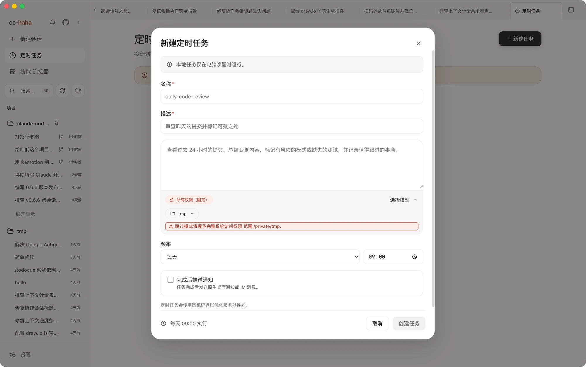

# Scheduled tasks

Save a prompt and have it run on a schedule. The usual jobs: review yesterday's commits every morning, tidy the backlog weekly, check a service's logs hourly.

You can create the task by hand on the desktop page or ask Claude to create it in conversation — both write the same local task.

## Where to start one

- **Desktop page** — click **Scheduled** in the sidebar to open the task list, then **+ New task** in the top right and fill in the form field by field.
- **Conversation** — say what to do and when in any session, for example "summarize yesterday's commits every weekday at 9:30". The app's built-in `LocalScheduledTask` tool turns it into a local task, which then shows up in the same task list.

The list page carries a standing notice about the following.

:::warning
Scheduled tasks only run while the desktop app is open and your computer is awake. Close the lid, quit the app, or shut down and nothing fires — and nothing is caught up afterwards. This is not a cloud scheduler: no process sits in the cloud keeping time for you, so a task only triggers while the local service is alive and the machine is awake.
:::

## Create and manage it in conversation

Conversation is equivalent to the form, minus the clicking. The tool is called `LocalScheduledTask` and talks to the app's own local API, so it only exists while the desktop app is running; with the app closed it does not appear.

- Give it a **cron expression** (5 fields, machine's local time: "minute hour day-of-month month day-of-week") and a **prompt**. "Every weekday at 9:30" is `30 9 * * 1-5`.
- For "remind me once at <time>" requests it pins the expression to that single moment and marks the task as non-recurring.
- The task is persisted by the local service, so it survives an app restart, and you can manage it from the task list page at any time.

You can also list, inspect, update, enable, disable, delete, or immediately run an existing task from conversation. Task ids are generated by the local service; list first rather than inventing one.

:::info
`/schedule` is something else entirely: it creates remote triggers that run in Anthropic's cloud, needs a claude.ai account and a cloud environment, and is not enabled in this local build. Don't use it for local tasks — use the sidebar page or just ask in conversation.
:::

## Every field in the form

- **Name** (required) — the identifier in the list. A hyphenated form like `daily-code-review` reads well.
- **Description** (required) — one line about what it does, so you recognize it later.
- **Prompt** — what actually gets sent to Claude. Give it the full context: what to look at, what to care about, what format to output. You won't be there to clarify.
- **Permissions** — fixed at **Full permissions (fixed)**; the form doesn't offer a choice. The prompt editor shows the directory scope of the run right below. So: **pick the narrowest possible working directory, and read your own prompt once before saving.**
- **Model** — set per task, independent of your session default. Routine checks are fine on a cheaper model.
- **Working directory** — where the task runs. You can also enable **Isolated worktree** so the task works in a separate Git worktree and never touches your main branch.
- **Frequency** — every N minutes, every N hours, daily, weekdays (Mon–Fri), specific days, monthly, or a custom cron expression. Time-of-day options get their own picker beside the frequency. Custom cron is "minute hour day month weekday" and invalid expressions are flagged as you type.
- **Timeout per run (seconds)** — optional. Leave blank to inherit the default: the `CC_HAHA_TASK_TIMEOUT_MS` environment variable when set, otherwise 600 seconds (10 minutes). It bounds only this task's single run — not ordinary chats or API requests.
- **Push notification on completion** — pick channels: native desktop notifications and any IM channels you've configured (Telegram, Feishu). Each IM channel requires one explicit **notification recipient**. Telegram can use the exclusive Bot, public Bot, or both; exclusive Telegram and Feishu use paired accounts, while public Telegram accepts only its paired owner. If no IM channel is set up, the form points you to **Settings → IM Adapters**; setup steps are in [Phone (H5) and IM](./remote.md).

Desktop notifications need **System Notifications** enabled in **Settings → General** and permission granted at the OS level.

Tasks fire with a small random delay so a dozen jobs don't all start on the same tick.

## Who gets the notification

An IM notification must name an explicit recipient. The system does **not** broadcast a task result to every paired user. Exclusive Telegram and Feishu recipients come from their paired accounts; public Telegram requires its single paired owner. The access allowlist is not notification authorization.

Telegram's **Delivery route** selects the exclusive Bot, public Bot, or both. Existing tasks without an entry selection keep the exclusive Bot. Public task notifications need no session subscription or exclusive pairing. Both Bots share one explicit recipient, who must satisfy both entry identities. Select the recipient explicitly; editing never silently replaces a saved, no-longer-valid owner. Public Bot setup and pairing are described in [Telegram](../im/telegram.md#turn-on-the-public-bot).

Before every public send or retry, the local service re-checks task registration, the real terminal run, notification settings, recipient, public Bot identity and allowed project directories. Deleted or unregistered tasks, forged runs, non-owners and tampered recipients fail visibly; changed identities never redirect to a new Bot. Task notifications are read-only and create no session-reply or approval association. The two entries are journalled independently; failure on one does not suppress the other. History separates exclusive and public delivery and shows delivered, failed or indeterminate outcomes.

If a recipient is unpaired, does not resolve to exactly one account, or does not exist, the delivery is recorded as a failure and sent to no one, rather than quietly going to everyone. The same applies when a task is created in conversation: if the user has not said who to notify, don't guess a target.

Desktop notifications go through the system notification center and need no recipient — just enable **System Notifications** in **Settings → General** and grant the OS permission.

## Once it's running

Each task card offers:

- **Run now** — don't wait for the next trigger. Do this once right after creating a task to confirm the prompt works.
- **Logs** — the execution log, one row per run, with status (running, completed, failed, timeout) and duration. **Summary** shows the output excerpt; **View conversation** jumps to the full session for that run.
- **Edit** — change any field, including the frequency.
- **Disable / Enable** — pause without deleting.
- **Delete** — removes the task and all of its logs permanently.

The three numbers at the top of the list are total tasks, active, and disabled.

## A few habits worth having

1. **Run it manually before setting a frequency.** Prompt problems show up on the very first run.
2. **Keep the working directory narrow.** The task runs with full permissions, so the directory is its boundary.
3. **Don't schedule it too tightly.** A task that runs every minute burns tokens fast and floods the log.
4. **Ask for a conclusion, not a transcript.** Put "summarize in three lines at the end" in the prompt, or the notification will be unreadable.
