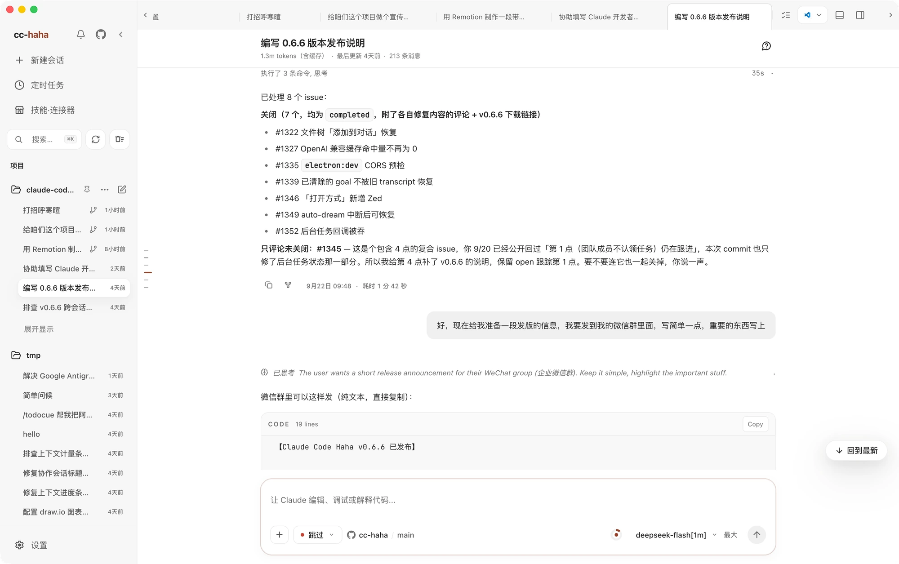

# What ccmax is

It's an app on your computer. You hand it a project folder, describe what you want in plain language, and it goes off to read the code, edit files, and run commands — with every change laid out in front of you, waiting for your approval.

That's a real session. Projects and history on the left, the conversation in the middle, and when Claude edits a file the diff appears right underneath, line by line.

## How this relates to the Claude Code CLI

Claude Code is Anthropic's command-line coding agent. The engine inside ccmax is a CLI built from repaired Claude Code sources (the primary command is `ccmax`; `claude-haha` / `cc-haha` remain as compatibility aliases), and the desktop app is the graphical shell wrapped around it.

Two practical consequences:

- **You don't install Claude Code first.** The CLI engine ships inside the installer. No Node.js, no npm, no global commands.
- **Nothing is missing.** Permission prompts, subagents, Skills, MCP, memory — it's the same machinery, just shown as an interface instead of scrolling terminal output.

If you'd rather stay in the terminal, the CLI is still there: see [Command line](../cli/index.md).

## What it does for you

**Writes code.** Describe a goal — add a feature, fix a bug, restyle a page — and it finds the files, reads the surrounding context, makes the edits, and tells you which files it touched.

**Shows its work.** Every edit comes with an inline diff, and the workspace panel on the right collects everything changed this turn into a list you can open file by file. Don't like it? Send it back.

**Delegates.** Big tasks can be split across subagents running in parallel, with their progress visible in the activity panel. You can also give each agent its own model, tools, and system prompt.

**Runs on a schedule.** Tidy up logs every morning, audit dependencies every week — set a job on a schedule and it clocks in on its own, leaving a record of each run.

**Follows you to your phone.** Turn on H5 access, scan a QR code, and pick the conversation back up on your phone. Or connect Telegram, Feishu, or WeChat and drive it from a chat window.

## Three commitments

**Local first.** Sessions, settings, memory, and skills live on your machine (under `~/.claude` by default). No accounts, no cloud sync, no uploading your code. The only outbound traffic goes to the model service you configured yourself.

**Your choice of model.** Nothing is locked to one vendor. Sign in with a Claude, ChatGPT, or Grok account; use a built-in preset for DeepSeek, Kimi, or Zhipu GLM; or point it at a local model running in LM Studio or Ollama and pay nothing at all.

**You approve the changes.** The default is "Ask permissions" — it stops and asks before writing a file or running a risky command. Loosen it to auto-accept edits, or tighten it so it can only plan and never touch a file. Five levels, switchable any time.

## Start here

Work through these in order; about twenty minutes gets you to a working first session.

1. [Download and install](./install.md) — installers for all three platforms, and what to do when the OS blocks them.
2. [Connect a model](./models.md) — official accounts, third-party APIs, or local models. Pick one.
3. [Run your first session](./first-session.md) — pick a folder, set permissions, state a goal, watch it work, review the diff.
4. [Desktop feature map](../desktop/index.md) — once it's running, see what else is in the box.

For a goal you can practice end to end, continue with the [practical guides](../cases/index.md): explore an unfamiliar project, fix a bug, preview a page, schedule a review, and continue on your phone.

Stuck along the way? [Won't install, won't open, won't connect](./troubleshooting.md) is organized by symptom.
